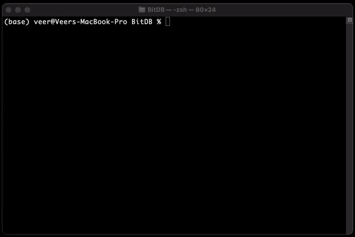
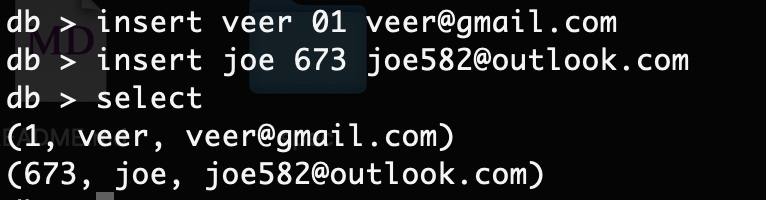
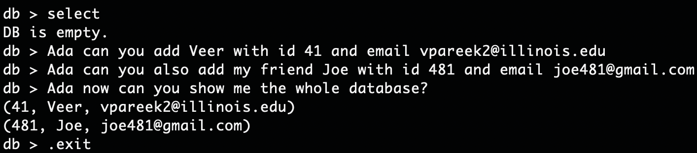

# BitDB           

  

BitDB is a lightweight skeleton database, very similar to SQLite. Stemming from my interest in learning more about both databases and memory operations in C, I created this project by watching Computer Architecture lectures and following cstack's database tutorial. After, I used ruby for testing different database scenarios and edge cases. Then, being a native mac user myself, I used Apple ML Research's brand new MLX library to implement a Mistral-7B model finetuned with lora to be a natural language to code generation assistant, named Ada. I took heavy inspiration from the llama example from the mlx repository, and adjusted the code to use mistral. (As of Dec 16 a mistral lora example has been added to the repo.) I wrote this setup guide for Mac because of the MLX usage in this project.

## Contents

* [Demo](#Demo)
* [Setup](#Setup)
* [Run](#Run)
* [Syntax](#Syntax)
* [Examples](#Examples)
* [Version](#Version)
* [References](#References)

## Demo


## Setup

First step is to ensure that you can compile the C program. Navigate to terminal and run the following command which installs Xcode which contains gcc, the compiler I used for this project. Follow the steps prompted after running this command.
```
xcode-select --install
```
Next, navigate to the model directory. Follow the steps in the readme that show you how to setup the Mistral-7B model.

## Run

Running this project is quite a simple process. First navigate to the project directory and run the following command to compile the C program.
```
gcc -o database db.c
```
To put it simply, hen you run the command above, the gcc compiler converts the C code in db.c into an executable file named database. It compiles the code, turns it into machine code, and links any necessary libraries to create a runnable program.

When you run the command below, you're executing the `database` program that was previously compiled, and passing `mydatabase.db` as an argument to it. The program `database` will then perform various database actions as defined in its code, and it uses mydatabase.db as a save file.

```
./database mydatabase.db
```

Note: You only need to compile the database the first time, after that you can run the save file using the second command and all your work will be saved.

## Syntax

The database is very simple. I built most of it from scratch so there is not a whole lot of functionality, yet. There are select and insert operations, and a Natural Language Processing (NLP) assistant named Ada.

To select, just simply write:
```
select
```
Currently the database is setup to take a Name, ID, and email. To insert write:
```
insert [Name] [ID] [email]
```

To use the Ada assistant just write Ada to start the line (Case Sensitive):
```
Ada [Insert Natural Language Query Here]
```

Also there are a couple of Meta commands that can be used. First there is 
```
.exit
```
which will exit the database and save your work to the save file. There is also
```
.btree
```
which will print the btree structure. This database is organized using a BTree for efficient time efficiency. Finally there is the
```
.constants
```
which will print out all the constant variables.

## Examples

Here is an example of the insert and select statements:<br>

<br><br><br>Here is an example of the Ada assistant functionality:<br><br>
<br><br>

## Version

* 0.2
   * Added Language Model Capability
   * Fixed Duplicate keys bug
   * Fixed database saving bug

* 0.1
    * Initial Release
    * Finished database functionality<br>

- [ ] Add in Update and Delete Functionality
- [X] Finish LLM assistant
- [X] Fix bug where the database doesn't save

## References
1. [Database Tutorial](https://cstack.github.io/db_tutorial/)
2. [MLX Library](https://github.com/ml-explore/mlx)
3. [MLX Examples](https://github.com/ml-explore/mlx-examples)
4. [Mistral 7B Paper](https://arxiv.org/abs/2310.06825)
5. [LoRA Paper](https://arxiv.org/abs/2106.09685)


